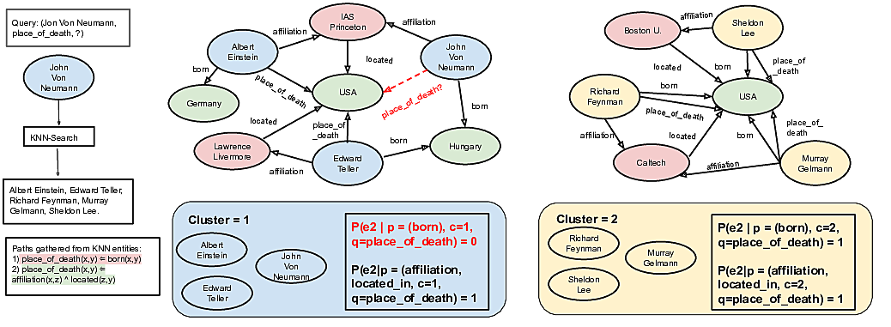
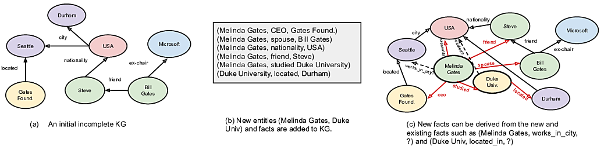

# Prob-CBR

Code for the EMNLP-Findings paper -- [Probabilistic Case-based Reasoning for Open-World Knowledge Graph Completion
](https://arxiv.org/abs/2010.03548)

## Download data

Download the experiment `prob-cbr-data` from [here](http://iesl.cs.umass.edu/downloads/cbr-akbc-data), untar it in the root directory of the project.
The compressed size is ~17M and uncompressed size is ~91M. 
```bash
wget http://iesl.cs.umass.edu/downloads/cbr-akbc-data/prob-cbr-data.tar.gz && tar xzvf prob-cbr-data.tar.gz
```

NOTE: `data_dir` expects the path to the top level directory `prob-cbr-data`

## KBC experiments



### Setup
We collect a subgraph around each entity in the KG. In practice, we gather a set of paths around each entity. This needs to be done once offline. If your KG 
is relatively small, you can simply run
```
python prob_cbr/data/get_paths.py --max_len 3 --num_paths_to_collect 1000
``` 
Please set the ```data_dir``` and ```dataset name``` appropriately in the script.

We can trivially speedup path collection by parallelizing this process to collect paths for a subset of entities. 
To do so first run, 
```
python prob_cbr/data/get_paths_parallel.py --get_unique_nodes
``` 
This first collects the set of all unique nodes in the KG. Then we can run this process for a subset of files.
Use the `job_id` and `total_jobs` arguments to run parallel process.
```
python prob_cbr/data/get_paths_parallel.py --job_id 0 --total_jobs 100
``` 
For our setup we use wandb and slurm to parallelize. If you have a similar setup refer to `prob_cbr/data/{path_collection_sweep_config.yaml, sbatch_run.sh}`.

### To reproduce results from the paper, run the following:

```bash
# WN18RR Table 3

python prob_cbr/pr_cbr.py --dataset WN18RR \
  --data_dir ../prob-cbr-data/ \
  --expt_dir ../prob-cbr-expts/ \
  --subgraph_file_name paths_1000_3hop_no_loop.pkl \
  --test \
  --max_num_programs 60 --k_adj 40 --linkage 0.25 \
  --num_paths_to_collect 1000 --max_path_len 3 --prevent_loops 1 \
  --name_of_run wn18rr_3hop_noloop_test

# WN18RR Table 5

python prob_cbr/pr_cbr.py --dataset WN18RR \
  --data_dir ../prob-cbr-data/ \
  --expt_dir ../prob-cbr-expts/ \
  --subgraph_file_name paths_1000_5hop_no_loop.pkl \
  --test \
  --max_num_programs 60 --k_adj 40 --linkage 0.25 \
  --num_paths_to_collect 1000 --max_path_len 5 --prevent_loops 1 \
  --name_of_run wn18rr_5hop_noloop_test
```

```bash
# FB122

python prob_cbr/pr_cbr.py --dataset FB122 \
  --data_dir ../prob-cbr-data/ \
  --expt_dir ../prob-cbr-expts/ \
  --subgraph_file_name paths_1000_3hop_no_loop.pkl \
  --test --test_file_name testI.txt \
  --max_num_programs 80 --k_adj 10 --linkage 0.6 \
  --num_paths_to_collect 1000 --max_path_len 3 --prevent_loops 1 \
  --name_of_run fb122_3hop_noloop_test1

python prob_cbr/pr_cbr.py --dataset FB122 \
  --data_dir ../prob-cbr-data/ \
  --expt_dir ../prob-cbr-expts/ \
  --subgraph_file_name paths_1000_3hop_no_loop.pkl \
  --test --test_file_name testII.txt \
  --max_num_programs 80 --k_adj 10 --linkage 0.6 \
  --num_paths_to_collect 1000 --max_path_len 3 --prevent_loops 1 \
  --name_of_run fb122_3hop_noloop_test2

python prob_cbr/pr_cbr.py --dataset FB122 \
  --data_dir ../prob-cbr-data/ \
  --expt_dir ../prob-cbr-expts/ \
  --subgraph_file_name paths_1000_3hop_no_loop.pkl \
  --test --test_file_name test.txt \
  --max_num_programs 80 --k_adj 10 --linkage 0.6 \
  --num_paths_to_collect 1000 --max_path_len 3 --prevent_loops 1 \
  --name_of_run fb122_3hop_noloop_test
```

```bash
# NELL

python prob_cbr/pr_cbr.py --dataset nell \
  --data_dir ../prob-cbr-data/ \
  --expt_dir ../prob-cbr-expts/ \
  --subgraph_file_name paths_1000_3hop_no_loop.pkl \
  --test --test_file_name testI.txt \
  --max_num_programs 25 --k_adj 15 --linkage 0.95 \
  --num_paths_to_collect 1000 --max_path_len 3 --prevent_loops 1 \
  --name_of_run nell_3hop_noloop_test
```

## KBC streaming experiments



### To reproduce results from the paper, run the following:

```bash
# WN18RR

python prob_cbr/prob_cbr_streaming.py -dataset WN18RR \
  --data_dir ../prob-cbr-data/ \
  --expt_dir ../prob-cbr-expts/ \
  --test --test_file_name testI.txt \
  --max_num_programs 200 --k_adj 50 --cluster_threshold 0.7 \
  --stream_init_proportion 0.5 --n_stream_updates 10 \
  --name_of_run online_stream_wn18rr_test
```

```bash
# FB122

python prob_cbr/prob_cbr_streaming.py -dataset FB122 \
  --data_dir ../prob-cbr-data/ \
  --expt_dir ../prob-cbr-expts/ \
  --test --test_file_name testI.txt \
  --max_num_programs 80 --k_adj 10 --cluster_threshold 0.6 \
  --stream_init_proportion 0.5 --n_stream_updates 10 \
  --name_of_run online_stream_fb122_test
```

### To speed up stream running time, you can use a preprocessing step

```bash
# Preprocessing
# PROC_NUM can be 
# -1 (to process all steps) 
# OR
# an int in range [0, n_stream_updates] to preprocess a certain step

python prob_cbr/prob_cbr_streaming.py -dataset FB122 \
  --data_dir ../prob-cbr-data/ \
  --expt_dir ../prob-cbr-expts/ \
  --test --test_file_name testI.txt \
  --max_num_programs 80 --k_adj 10 --cluster_threshold 0.6 \
  --stream_init_proportion 0.5 --n_stream_updates 10 \
  --name_of_run online_stream_fb122_test \
  --just_preprocess --process_num $PROC_NUM
```

```bash
# Actual run

python prob_cbr/prob_cbr_streaming.py -dataset FB122 \
  --data_dir ../prob-cbr-data/ \
  --expt_dir ../prob-cbr-expts/ \
  --test --test_file_name testI.txt \
  --max_num_programs 80 --k_adj 10 --cluster_threshold 0.6 \
  --stream_init_proportion 0.5 --n_stream_updates 10 \
  --name_of_run online_stream_fb122_test \
  --warm_start
```

### KBC streaming experiments with RotatE

The code can be found [here](https://github.com/ameyagodbole/KnowledgeGraphEmbedding/tree/online_stream)

## Citation

```
@inproceedings{prob_cbr,
  title = {Probabilistic Case-based Reasoning for Open-World Knowledge Graph Completion},
  author = {Das, Rajarshi and Godbole, Ameya and Monath, Nicholas and Zaheer, Manzil and McCallum, Andrew},
  booktitle = {Findings of EMNLP},
  year = 2020
}
```
